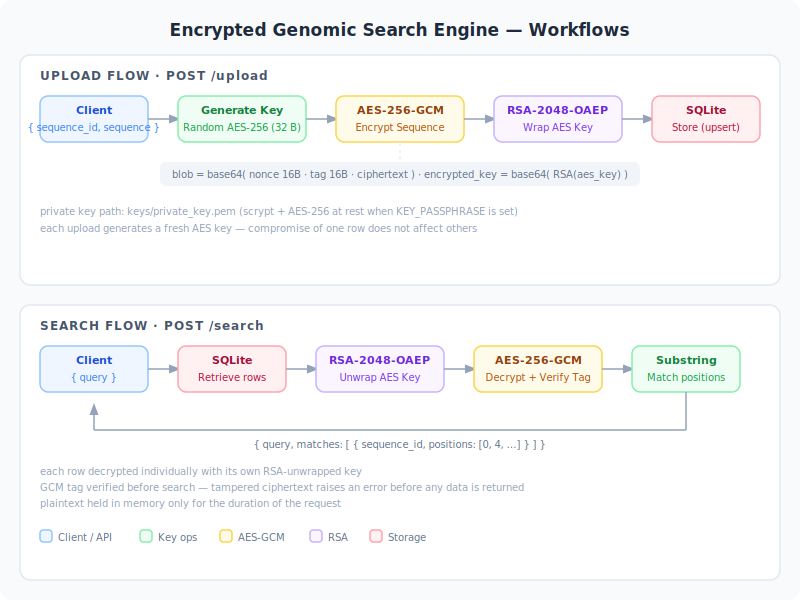

# Encrypted Genomic Search Engine

This project grew out of my Discrete Mathematics II course. While studying cryptographic primitives — RSA, modular arithmetic, finite fields — I got curious about what it would look like to apply that theory to real biological data. Genomic sequences felt like the right testbed: they're sensitive, repetitive, and large enough that both the encryption scheme and the search algorithm actually matter. The result is a FastAPI service that stores sequences under AES-256-GCM encryption with RSA hybrid key management, and lets you search across them without ever exposing plaintext at rest.

---

## Architecture

Each uploaded sequence gets a fresh random AES-256 key. That key is RSA-OAEP-wrapped with the server's public key and stored in the database alongside the ciphertext. Authenticated encryption (GCM) ensures both confidentiality and integrity — the tag detects any tampering before decryption.



**Why per-sequence keys?** Compromise of one row's AES key does not affect any other sequence.

**Why AES-GCM over ECB or CBC?** ECB leaks block patterns (especially bad for repetitive genomic data). CBC needs careful IV handling and is vulnerable to padding oracles. GCM is authenticated, requires no padding, and produces a compact nonce + tag + ciphertext blob.

---

## Setup

```bash
python -m venv venv
source venv/bin/activate
pip install -r requirements.txt
```

---

## Running the API

### Basic start

```bash
cd src
uvicorn api_server:app --reload
```

The server starts on `http://localhost:8000`. On first run it generates an RSA-2048 key pair and saves it to `keys/private_key.pem`. Subsequent restarts load the same key, so previously stored sequences remain decryptable.

### With an encrypted key file (recommended)

```bash
export KEY_PASSPHRASE="your-passphrase"
cd src
uvicorn api_server:app --reload
```

When `KEY_PASSPHRASE` is set, the private key file is encrypted with scrypt + AES-256. Without it, the key is saved as a plain PEM — fine for local development, not for production.

### Custom host / port

```bash
uvicorn api_server:app --host 0.0.0.0 --port 8080 --reload
```

### Interactive API docs

Once running, open **`http://localhost:8000/docs`** for the Swagger UI — every endpoint has a "Try it out" button for testing without curl.

---

## API Reference

| Method | Endpoint | Description |
|--------|----------|-------------|
| GET | `/` | Health check |
| POST | `/upload` | Encrypt and store a genomic sequence |
| GET | `/genome/{sequence_id}` | Return the stored ciphertext for a sequence |
| POST | `/search` | Search a query substring across all stored sequences |

### Upload a sequence

```bash
curl -X POST http://localhost:8000/upload \
  -H "Content-Type: application/json" \
  -d '{"sequence_id": "brca1", "sequence": "ATCGATCGATCGAAGCTTGCATGCCTGCAG"}'
```

```json
{"message": "Genome uploaded successfully", "sequence_id": "brca1"}
```

### Search across all sequences

```bash
curl -X POST http://localhost:8000/search \
  -H "Content-Type: application/json" \
  -d '{"query": "ATCG"}'
```

```json
{
  "query": "ATCG",
  "matches": [
    {"sequence_id": "brca1", "positions": [0, 4, 8]}
  ]
}
```

### Retrieve stored ciphertext

```bash
curl http://localhost:8000/genome/brca1
```

```json
{
  "sequence_id": "brca1",
  "encrypted_sequence": "2URBd4G4r3q5xS8s..."
}
```

### Not found

```bash
curl http://localhost:8000/genome/unknown
# HTTP 404
# {"detail": "Genome 'unknown' not found"}
```

---

## Run the CLI demo

```bash
cd src
python main.py
```

Demonstrates the full pipeline end-to-end: FASTA loading, 2-bit DNA binary encoding, AES-256-GCM encryption, RSA key wrapping, SQLite round-trip, and k-mer index search.

---

## Module overview

| File | Purpose |
|------|---------|
| `aes_storage.py` | AES-256-GCM encrypt/decrypt; stores nonce + tag + ciphertext as a single base64 blob |
| `rsa_manager.py` | RSA-2048 key generation, PKCS1-OAEP key wrapping, and persistent key loading |
| `genome_database.py` | SQLite persistence with upsert semantics and automatic schema migration |
| `genome_search.py` | Linear scan substring search; k-mer index-assisted search |
| `kmer_indexer.py` | Builds an O(1) k-mer lookup index over plaintext sequences |
| `fasta_loader.py` | BioPython FASTA parser |
| `dna_encoder.py` | 2-bit binary encoding (A=00, C=01, G=10, T=11) |
| `api_server.py` | FastAPI service wiring all modules together |
| `main.py` | CLI walkthrough of the full pipeline |

---

## Key management

The RSA private key is stored at `keys/private_key.pem` (gitignored). On first start the server generates and saves it; on subsequent starts it loads the existing key, so sequences remain decryptable across restarts.

Set `KEY_PASSPHRASE` to encrypt the key file at rest with scrypt + AES-256:

```bash
export KEY_PASSPHRASE="your-passphrase"
uvicorn api_server:app --reload
```

Without `KEY_PASSPHRASE` the key is saved as an unencrypted PEM — acceptable for local development, not for production. In production, replace `load_or_generate_keys` with a KMS-backed equivalent and remove `keys/` entirely.
